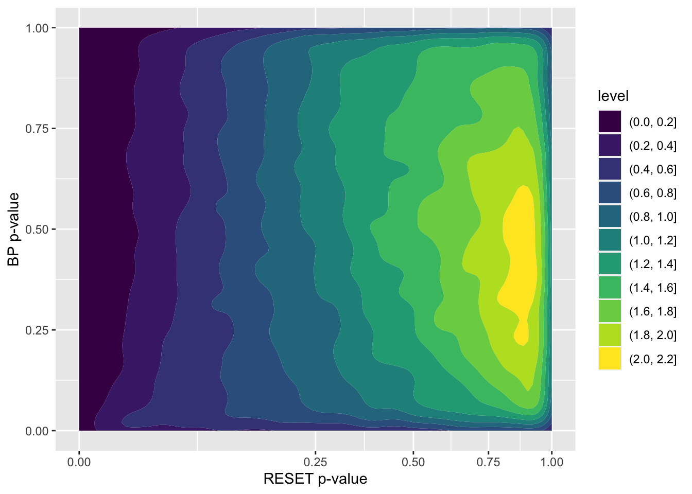
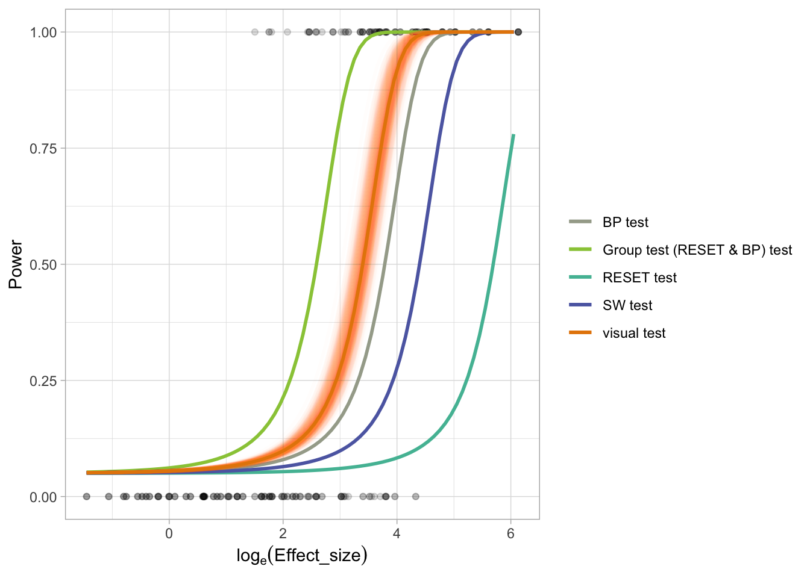

# Use the entire dataset to perform power analysis

The idea is to use conventional tests to decide if the model is correctly specified in regards of the type of the departures. This may lead to Type III error though.

## Load libraries


```r
library(tidyverse)
library(visage)
```

## Load data

### Visual test data


```r
visual_test_dat <- vi_survey %>%
  filter(x_dist == "uniform", !attention_check, !null_lineup) %>%
  select(unique_lineup_id, effect_size, type, p_value) %>%
  group_by(unique_lineup_id) %>%
  summarise(across(everything(), first))
```


```r
head(visual_test_dat)
#> # A tibble: 6 × 4
#>   unique_lineup_id effect_size type                p_value
#>   <chr>                  <dbl> <chr>                 <dbl>
#> 1 heter_101             272.   heteroskedasticity 0.000269
#> 2 heter_105               1.84 heteroskedasticity 0.824   
#> 3 heter_110              20.6  heteroskedasticity 0.924   
#> 4 heter_116              40.8  heteroskedasticity 0.0438  
#> 5 heter_120               7.97 heteroskedasticity 0.0147  
#> 6 heter_121              44.3  heteroskedasticity 0.0605
```


### Conventional test data


```r
poly_conv_sim <- readRDS("data/poly_conventional_simulation.rds")
heter_conv_sim <- readRDS("data/heter_conventional_simulation.rds")

# Borrow effect size from the survey
poly_conv_sim <- poly_conv_sim %>%
  left_join(select(filter(vi_survey, type == "polynomial"), 
                   shape, e_sigma, n, x_dist, effect_size))

heter_conv_sim <- heter_conv_sim %>%
  left_join(select(filter(vi_survey, type == "heteroskedasticity"), 
                   a, b, n, x_dist, effect_size))
```


```r
conv_test_dat <- bind_rows(poly_conv_sim, heter_conv_sim) %>%
  filter(x_dist == "uniform")
head(conv_test_dat)
#> # A tibble: 6 × 19
#>   shape e_sigma x_dist     n F_p_v…¹ RESET…² RESET…³ RESET…⁴
#>   <dbl>   <dbl> <chr>  <dbl>   <dbl>   <dbl>   <dbl>   <dbl>
#> 1     3       1 unifo…    50 5.24e-5   0.152 9.15e-4 8.29e-4
#> 2     3       1 unifo…    50 5.24e-5   0.152 9.15e-4 8.29e-4
#> 3     3       1 unifo…    50 5.24e-5   0.152 9.15e-4 8.29e-4
#> 4     3       1 unifo…    50 5.24e-5   0.152 9.15e-4 8.29e-4
#> 5     3       1 unifo…    50 5.24e-5   0.152 9.15e-4 8.29e-4
#> 6     3       1 unifo…    50 5.24e-5   0.152 9.15e-4 8.29e-4
#> # … with 11 more variables: RESET6_p_value <dbl>,
#> #   RESET7_p_value <dbl>, RESET8_p_value <dbl>,
#> #   RESET9_p_value <dbl>, RESET10_p_value <dbl>,
#> #   BP_p_value <dbl>, SW_p_value <dbl>, boot_id <int>,
#> #   effect_size <dbl>, a <dbl>, b <dbl>, and abbreviated
#> #   variable names ¹​F_p_value, ²​RESET3_p_value,
#> #   ³​RESET4_p_value, ⁴​RESET5_p_value
```

## Compute GLM for visual test

### Define the minimum and maximum effect size


```r
min_es <- vi_survey %>% 
  filter(!null_lineup, 
         !attention_check,
         x_dist == "uniform") %>%
  pull(effect_size) %>%
  min()

max_es <- vi_survey %>% 
  filter(!null_lineup, 
         !attention_check,
         x_dist == "uniform") %>%
  pull(effect_size) %>%
  max()
```


```r
c(log(min_es), log(max_es))
#> [1] -1.450875  6.132414
```


### Fit the model


```r
visual_mod <- visual_test_dat %>%
  mutate(offset0 = log(0.05/0.95)) %>%
  mutate(reject = p_value <= 0.05) %>%
  
  # Slope-only model
  glm(reject ~ effect_size - 1,
      family = binomial(),
      data = .,
      offset = offset0)
```


```r
summary(visual_mod)
#> 
#> Call:
#> glm(formula = reject ~ effect_size - 1, family = binomial(), 
#>     data = ., offset = offset0)
#> 
#> Deviance Residuals: 
#>     Min       1Q   Median       3Q      Max  
#> -3.0104  -0.4070  -0.3307   0.1368   2.2719  
#> 
#> Coefficients:
#>             Estimate Std. Error z value Pr(>|z|)    
#> effect_size 0.098306   0.007402   13.28   <2e-16 ***
#> ---
#> Signif. codes:  
#> 0 '***' 0.001 '**' 0.01 '*' 0.05 '.' 0.1 ' ' 1
#> 
#> (Dispersion parameter for binomial family taken to be 1)
#> 
#>     Null deviance: 741.18  on 279  degrees of freedom
#> Residual deviance: 195.65  on 278  degrees of freedom
#> AIC: 197.65
#> 
#> Number of Fisher Scoring iterations: 7
```


### Make prediction for the visual model


```r
visual_pred <- data.frame(effect_size = exp(seq(log(min_es), 
                                                log(max_es), 
                                                0.1))) %>%
  mutate(power = predict(visual_mod, 
                         type = "response",
                         newdata = data.frame(effect_size = effect_size,
                                              offset0 = log(0.05/0.95)))) %>%
  mutate(log_effect_size = log(effect_size))
```


```r
head(visual_pred)
#>   effect_size      power log_effect_size
#> 1   0.2343650 0.05110579      -1.4508755
#> 2   0.2590134 0.05122343      -1.3508755
#> 3   0.2862541 0.05135373      -1.2508755
#> 4   0.3163597 0.05149810      -1.1508755
#> 5   0.3496315 0.05165810      -1.0508755
#> 6   0.3864026 0.05183548      -0.9508755
```

### Make bootstrap prediction for the visual model


```r
visual_boot_pred <- map_dfr(1:500, function(boot_id) {
  
  boot_mod <- visual_test_dat %>%
    mutate(offset0 = log(0.05/0.95)) %>%
    mutate(reject = p_value <= 0.05) %>%
    slice_sample(n = nrow(.), replace = TRUE) %>%
    update(visual_mod, data = .)
  
  data.frame(effect_size = exp(seq(log(min_es), 
                                   log(max_es), 
                                   0.1))) %>%
  mutate(power = predict(boot_mod, 
                         type = "response",
                         newdata = data.frame(effect_size = effect_size,
                                              offset0 = log(0.05/0.95)))) %>%
  mutate(log_effect_size = log(effect_size)) %>%
  mutate(boot_id = boot_id)
})
```


## Compute GLM for conventional tests


```r
conv_pred <- conv_test_dat %>%
  select(-RESET3_p_value, -(RESET5_p_value:RESET10_p_value), -F_p_value) %>%
  rename(RESET_p_value = RESET4_p_value) %>%
  pivot_longer(RESET_p_value:SW_p_value) %>%
  mutate(name = gsub("_p_value", " test", name)) %>%
  mutate(reject = value <= 0.05) %>%
  select(effect_size, name, reject) %>%
  mutate(offset0 = log(0.05/0.95)) %>%
  nest(dat = c(effect_size, offset0, reject)) %>%
  mutate(mod = map(dat, 
                   ~glm(reject ~ effect_size - 1, 
                        family = binomial(), 
                        data = .x,
                        offset = offset0))) %>%
  mutate(power = map(mod, function(mod) {
    data.frame(effect_size = exp(seq(log(min_es),
                                     log(max_es),
                                     0.1)),
               offset0 = log(0.05/0.95)) %>%
      mutate(power = predict(mod, type = "response", newdata = .))
  })) %>%
  select(-dat, -mod) %>%
  unnest(power) %>%
  select(-offset0) %>%
  mutate(log_effect_size = log(effect_size))
```

## Draw the plot


```r
ggplot() +
  geom_point(data = visual_test_dat,
             aes(log(effect_size), as.numeric(p_value <= 0.05)),
             alpha = 0.15) +
  
  geom_line(data = conv_pred,
            aes(log_effect_size, power, col = name),
            size = 1) +
  
  geom_line(data = visual_boot_pred,
            aes(log_effect_size, power, col = "visual test", group = boot_id),
            size = 1,
            alpha = 0.01) +
  
  geom_line(data = visual_pred,
            aes(log_effect_size, power, col = "visual test"), 
            size = 1) +
  
  theme_light() +
  scale_color_manual(values = rev(rcartocolor::carto_pal(4, "Vivid"))) +
  xlab(expression(log[e] (Effect_size))) +
  ylab("Power") +
  labs(col = "", size = "# lineups")
```


# Conventional group tests

If we group certain conventional tests together as a single test, we need to adjust the significance level for each individual test.

Considering a group test consisting of a RESET test and a BP test, we can plot their $p$-values against each other based on the simulated data.


```r
set.seed(10086)

stand_dist <- function(x) (x - min(x))/max(x - min(x)) * 2 - 1

conv_null_dat <- map_dfr(1:100000, function(i) {
  
  x_dist <- sample(c("uniform", 
                     "normal", 
                     "lognormal", 
                     "even_discrete"), 1)
  x <- switch(x_dist,
              uniform = rand_uniform(-1, 1),
              normal = {
                raw_x <- rand_normal(sigma = 0.3)
                closed_form(~stand_dist(raw_x))
                },
              lognormal = {
                raw_x <- rand_lognormal(sigma = 0.6)
                closed_form(~stand_dist(raw_x/3 - 1))
                },
              even_discrete = rand_uniform_d(k = 5, even = TRUE))
        
  mod <- poly_model(include_z = FALSE, x = x)
  
  n <- sample(c(50, 100, 300), 1)
  
  tmp_dat <- mod$gen(n)
  
  tibble(x_dist = x_dist,
         n = n,
         F_p_value = mod$test(tmp_dat)$p_value,
         RESET_p_value = mod$test(tmp_dat, 
                                  test = "RESET", 
                                  power = 2:4, 
                                  power_type = "fitted")$p_value,
         BP_p_value = HETER_MODEL$test(tmp_dat)$p_value,
         SW_p_value = shapiro.test(tmp_dat$.resid)$p.value,
         boot_id = i)
})
```


```r
conv_null_dat %>%
  ggplot() +
  geom_density2d_filled(aes(RESET_p_value, BP_p_value)) +
  scale_x_sqrt() +
  scale_x_sqrt() +
  xlab("RESET p-value") +
  ylab("BP p-value")
```




We can pick a rectangle area at the bottom left corner such that $P(\text{RESET rejects } H_0 \text{ or BP rejects } H_0) = \alpha$. The side length of this rectangle is denoted as $\alpha^*$.


```r
alpha_star <- map_dbl(seq(0.0001, 0.05, 0.0005), function(alpha_star) {
  conv_null_dat %>%
    filter(RESET_p_value <= alpha_star | BP_p_value <= alpha_star) %>%
    nrow()/nrow(conv_null_dat)
}) %>%
  {seq(0.0001, 0.05, 0.0005)[which.min(abs(. - 0.05))]}
```


```r
alpha_star
#> [1] 0.0271
```

## Fit GLM


```r
conv_test_group_dat <- conv_test_dat %>%
  mutate(`Group test (RESET & BP)_p_value` = ifelse(RESET4_p_value <= alpha_star | BP_p_value <= alpha_star, 0, 1)) %>%
  relocate(`Group test (RESET & BP)_p_value`, .after = SW_p_value)
```


```r
conv_pred_group <- conv_test_group_dat %>%
  select(-RESET3_p_value, -(RESET5_p_value:RESET10_p_value), -F_p_value) %>%
  rename(RESET_p_value = RESET4_p_value) %>%
  pivot_longer(RESET_p_value:`Group test (RESET & BP)_p_value`) %>%
  mutate(name = gsub("_p_value", " test", name)) %>%
  mutate(reject = value <= 0.05) %>%
  select(effect_size, name, reject) %>%
  mutate(offset0 = log(0.05/0.95)) %>%
  nest(dat = c(effect_size, offset0, reject)) %>%
  mutate(mod = map(dat, 
                   ~glm(reject ~ effect_size - 1, 
                        family = binomial(), 
                        data = .x,
                        offset = offset0))) %>%
  mutate(power = map(mod, function(mod) {
    data.frame(effect_size = exp(seq(log(min_es),
                                     log(max_es),
                                     0.1)),
               offset0 = log(0.05/0.95)) %>%
      mutate(power = predict(mod, type = "response", newdata = .))
  })) %>%
  select(-dat, -mod) %>%
  unnest(power) %>%
  select(-offset0) %>%
  mutate(log_effect_size = log(effect_size))
```

## Draw plot


```r
ggplot() +
  geom_point(data = visual_test_dat,
             aes(log(effect_size), as.numeric(p_value <= 0.05)),
             alpha = 0.15) +
  
  geom_line(data = conv_pred_group,
            aes(log_effect_size, power, col = name),
            size = 1) +
  
  geom_line(data = visual_boot_pred,
            aes(log_effect_size, power, col = "visual test", group = boot_id),
            size = 1,
            alpha = 0.01) +
  
  geom_line(data = visual_pred,
            aes(log_effect_size, power, col = "visual test"), 
            size = 1) +
  
  theme_light() +
  scale_color_manual(values = rev(rcartocolor::carto_pal(5, "Vivid"))) +
  xlab(expression(log[e] (Effect_size))) +
  ylab("Power") +
  labs(col = "", size = "# lineups")
```



The group test has higher power than the visual test in this case.

# Group test (RESET, BP and SW)

Let's consider a group test consisting of the RESET test, BP test and the SW test.


```r
alpha_star2 <- map_dbl(seq(0.0001, 0.05, 0.0005), function(alpha_star) {
  conv_null_dat %>%
    filter(RESET_p_value <= alpha_star | SW_p_value <= alpha_star) %>%
    nrow()/nrow(conv_null_dat)
}) %>%
  {seq(0.0001, 0.05, 0.0005)[which.min(abs(. - 0.05))]}
```


```r
alpha_star2
#> [1] 0.0246
```


```r
alpha_star3 <- map_dbl(seq(0.0001, 0.05, 0.0005), function(alpha_star) {
  conv_null_dat %>%
    filter(BP_p_value <= alpha_star | SW_p_value <= alpha_star) %>%
    nrow()/nrow(conv_null_dat)
}) %>%
  {seq(0.0001, 0.05, 0.0005)[which.min(abs(. - 0.05))]}
```


```r
alpha_star3
#> [1] 0.0266
```


```r
alpha_star4 <- map_dbl(seq(0.0001, 0.05, 0.0005), function(alpha_star) {
  conv_null_dat %>%
    filter(RESET_p_value <= alpha_star | BP_p_value <= alpha_star | SW_p_value <= alpha_star) %>%
    nrow()/nrow(conv_null_dat)
}) %>%
  {seq(0.0001, 0.05, 0.0005)[which.min(abs(. - 0.05))]}
```


```r
alpha_star4
#> [1] 0.0176
```

## Fit GLM


```r
conv_test_group_dat <- conv_test_dat %>%
  mutate(`Group (RESET & BP)_p_value` = ifelse(RESET4_p_value <= alpha_star | BP_p_value <= alpha_star, 0, 1)) %>%
  relocate(`Group (RESET & BP)_p_value`, .after = SW_p_value) %>%
  
  mutate(`Group (RESET & SW)_p_value` = ifelse(RESET4_p_value <= alpha_star2 | SW_p_value <= alpha_star2, 0, 1)) %>%
  relocate(`Group (RESET & SW)_p_value`, .after = `Group (RESET & BP)_p_value`) %>%
  
  mutate(`Group (BP & SW)_p_value` = ifelse(BP_p_value <= alpha_star3 | SW_p_value <= alpha_star3, 0, 1)) %>%
  relocate(`Group (BP & SW)_p_value`, .after = `Group (RESET & SW)_p_value`) %>%
  
  mutate(`Group (RESET & BP & SW)_p_value` = ifelse(RESET4_p_value <= alpha_star3 | BP_p_value <= alpha_star3 | SW_p_value <= alpha_star3, 0, 1)) %>%
  relocate(`Group (RESET & BP & SW)_p_value`, .after = `Group (BP & SW)_p_value`)
```


```r
conv_pred_group <- conv_test_group_dat %>%
  select(-RESET3_p_value, -(RESET5_p_value:RESET10_p_value), -F_p_value) %>%
  rename(RESET_p_value = RESET4_p_value) %>%
  pivot_longer(RESET_p_value:`Group (RESET & BP & SW)_p_value`) %>%
  mutate(name = gsub("_p_value", " test", name)) %>%
  mutate(reject = value <= 0.05) %>%
  select(effect_size, name, reject) %>%
  mutate(offset0 = log(0.05/0.95)) %>%
  nest(dat = c(effect_size, offset0, reject)) %>%
  mutate(mod = map(dat, 
                   ~glm(reject ~ effect_size - 1, 
                        family = binomial(), 
                        data = .x,
                        offset = offset0))) %>%
  mutate(power = map(mod, function(mod) {
    data.frame(effect_size = exp(seq(log(min_es),
                                     log(max_es),
                                     0.1)),
               offset0 = log(0.05/0.95)) %>%
      mutate(power = predict(mod, type = "response", newdata = .))
  })) %>%
  select(-dat, -mod) %>%
  unnest(power) %>%
  select(-offset0) %>%
  mutate(log_effect_size = log(effect_size))
```


```r
conv_pred_group <- conv_pred_group %>%
  mutate(name = factor(name, levels = c("Group (RESET & BP & SW) test",
                                        "Group (RESET & BP) test",
                                        "Visual test",
                                        "Group (RESET & SW) test",
                                        "Group (BP & SW) test",
                                        "BP test",
                                        "SW test",
                                        "RESET test")))
```


## Draw plot


```r
ggplot() +
  geom_point(data = visual_test_dat,
             aes(log(effect_size), as.numeric(p_value <= 0.05)),
             alpha = 0.15) +
  
  geom_line(data = conv_pred_group,
            aes(log_effect_size, power, col = name),
            size = 1) +
  
  geom_line(data = visual_boot_pred,
            aes(log_effect_size, power, col = "Visual test", group = boot_id),
            size = 1,
            alpha = 0.01) +

  geom_line(data = visual_pred,
            aes(log_effect_size, power, col = "Visual test"),
            size = 1) +
  
  theme_light() +
  # scale_color_brewer(palette = "Set3") +
  scale_color_manual(breaks = levels(conv_pred_group$name), 
                     values = rev(rcartocolor::carto_pal(8, "Vivid"))) +
  xlab(expression(log[e] (Effect_size))) +
  ylab("Power") +
  labs(col = "", size = "# lineups") +
  theme(legend.position = "bottom")
```


The sensitivity of the tests are ordered as follows: 

- Group test (RESET & BP & SW)
- Group test (RESET & BP)
- Visual test
- Group test (RESET & SW) test
- Group test (BP & SW) test
- BP test
- SW test
- RESET test


# Compute vision models

## Data

There are 8860 observations in `vi_survey`. This includes all the attention checks and null lineups. If we need more data, the cost per observation is around 0.25 Australian Dollar. The time needs for collecting the data is around 6 minutes per observation. 

## Types of model grouped by types of training data

- Pure human training data
- Simulated data + human data
- Pure simulated data

If we want a model that can mimic the behaviour of human, the direct way to train it is to use human data. 

A larger training set can be formed if simulated data are also used.

Model trained with pure simulated data may not perform like humans. It is more like a conventional test that summarizes the information of residuals. Though it may not like a visual test conducted by human, it is still valuable.

#### Concerns

Do we have sufficient data to train such a model? Some say we generally need >1000 images for a label.

Can the model detect residual departures other than non-linearity and heteroskedasticity? 
- It depends. If the model actually learns to select the most different residual plot, there is a chance of detecting other departures. But if the model only learns to detect the shapes we feed, then it probably will not be able to do it, unless other departures share similar characteristics of non-linearity and heteroskedasticity.

Can the model detect non-linearity and heteroskedasticity shapes other than what we design?


## Potential methods

https://paperswithcode.com/

### Cores of computer vision models

- CNN
  - Pooling layers
  - Convolutional layers
- Boltzmann family
  - Restricted Boltzmann Machines
  - Deep Belief Networks
  - Deep Boltzmann Machines
- Autoencoder
  - Denoising Autoencoders
  - Stacked Autoencoders


- Autoencoders
  - Distance between two data points in the embedding space (e.g. Faiss - Facebook)
  - Anomaly detection
  


