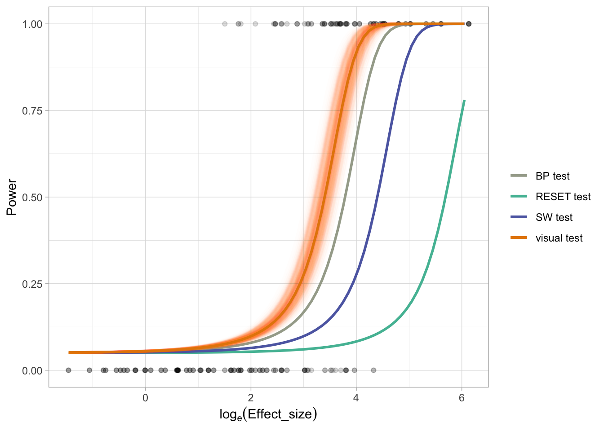

# Check the performance of conventional tests and visual tests in detecting model violations

We have compared the performance of conventional tests and visual tests in detecting non-linearity and heteroskedasticity separately. In this chapter, we try to conduct a similar analysis but on the entire set of data. Using conventional tests to test residual departures they are not designed for may introduce Type III error. For example, the RESET test may correctly reject the null hypothesis but fail to identify the alternative hypothesis is the existence of heteroskedasticity.

## Load libraries


```r
library(tidyverse)
library(visage)
```

## Load data

### Visual test data

Data with uniform distribution will be used similar to the paper. 


```r
visual_test_dat <- vi_survey %>%
  filter(x_dist == "uniform", !attention_check, !null_lineup) %>%
  select(unique_lineup_id, effect_size, type, p_value) %>%
  group_by(unique_lineup_id) %>%
  summarise(across(everything(), first))
```


```r
head(visual_test_dat)
#> # A tibble: 6 × 4
#>   unique_lineup_id effect_size type                p_value
#>   <chr>                  <dbl> <chr>                 <dbl>
#> 1 heter_101             272.   heteroskedasticity 0.000269
#> 2 heter_105               1.84 heteroskedasticity 0.824   
#> 3 heter_110              20.5  heteroskedasticity 0.924   
#> 4 heter_116              40.6  heteroskedasticity 0.0438  
#> 5 heter_120               8.04 heteroskedasticity 0.0147  
#> 6 heter_121              44.4  heteroskedasticity 0.0605
```


### Conventional test data

The simulation data is borrowed from the paper.


```r
poly_conv_sim <- readRDS("data/poly_conventional_simulation.rds")
heter_conv_sim <- readRDS("data/heter_conventional_simulation.rds")

# Borrow effect size from the survey
poly_conv_sim <- poly_conv_sim %>%
  left_join(select(filter(vi_survey, type == "polynomial"), 
                   shape, e_sigma, n, x_dist, effect_size))

heter_conv_sim <- heter_conv_sim %>%
  left_join(select(filter(vi_survey, type == "heteroskedasticity"), 
                   a, b, n, x_dist, effect_size))
```


```r
conv_test_dat <- bind_rows(poly_conv_sim, heter_conv_sim) %>%
  filter(x_dist == "uniform")
head(conv_test_dat)
#> # A tibble: 6 × 19
#>   shape e_sigma x_dist     n F_p_v…¹ RESET…² RESET…³ RESET…⁴
#>   <dbl>   <dbl> <chr>  <dbl>   <dbl>   <dbl>   <dbl>   <dbl>
#> 1     3       1 unifo…    50 5.24e-5   0.152 9.15e-4 8.29e-4
#> 2     3       1 unifo…    50 5.24e-5   0.152 9.15e-4 8.29e-4
#> 3     3       1 unifo…    50 5.24e-5   0.152 9.15e-4 8.29e-4
#> 4     3       1 unifo…    50 5.24e-5   0.152 9.15e-4 8.29e-4
#> 5     3       1 unifo…    50 5.24e-5   0.152 9.15e-4 8.29e-4
#> 6     3       1 unifo…    50 5.24e-5   0.152 9.15e-4 8.29e-4
#> # … with 11 more variables: RESET6_p_value <dbl>,
#> #   RESET7_p_value <dbl>, RESET8_p_value <dbl>,
#> #   RESET9_p_value <dbl>, RESET10_p_value <dbl>,
#> #   BP_p_value <dbl>, SW_p_value <dbl>, boot_id <int>,
#> #   effect_size <dbl>, a <dbl>, b <dbl>, and abbreviated
#> #   variable names ¹​F_p_value, ²​RESET3_p_value,
#> #   ³​RESET4_p_value, ⁴​RESET5_p_value
```

## Compute GLM for visual test

### Define the minimum and maximum effect size


```r
min_es <- vi_survey %>% 
  filter(!null_lineup, 
         !attention_check,
         x_dist == "uniform") %>%
  pull(effect_size) %>%
  min()

max_es <- vi_survey %>% 
  filter(!null_lineup, 
         !attention_check,
         x_dist == "uniform") %>%
  pull(effect_size) %>%
  max()
```


```r
c(log(min_es), log(max_es))
#> [1] -1.461160  6.132414
```


### Fit the model


```r
visual_mod <- visual_test_dat %>%
  mutate(offset0 = log(0.05/0.95)) %>%
  mutate(reject = p_value <= 0.05) %>%
  
  # Slope-only model
  glm(reject ~ effect_size - 1,
      family = binomial(),
      data = .,
      offset = offset0)
```


```r
summary(visual_mod)
#> 
#> Call:
#> glm(formula = reject ~ effect_size - 1, family = binomial(), 
#>     data = ., offset = offset0)
#> 
#> Deviance Residuals: 
#>     Min       1Q   Median       3Q      Max  
#> -3.0109  -0.4070  -0.3306   0.1362   2.2717  
#> 
#> Coefficients:
#>             Estimate Std. Error z value Pr(>|z|)    
#> effect_size 0.098421   0.007411   13.28   <2e-16 ***
#> ---
#> Signif. codes:  
#> 0 '***' 0.001 '**' 0.01 '*' 0.05 '.' 0.1 ' ' 1
#> 
#> (Dispersion parameter for binomial family taken to be 1)
#> 
#>     Null deviance: 741.18  on 279  degrees of freedom
#> Residual deviance: 195.52  on 278  degrees of freedom
#> AIC: 197.52
#> 
#> Number of Fisher Scoring iterations: 7
```


### Make prediction for the visual model


```r
visual_pred <- data.frame(effect_size = exp(seq(log(min_es), 
                                                log(max_es), 
                                                0.1))) %>%
  mutate(power = predict(visual_mod, 
                         type = "response",
                         newdata = data.frame(effect_size = effect_size,
                                              offset0 = log(0.05/0.95)))) %>%
  mutate(log_effect_size = log(effect_size))
```


```r
head(visual_pred)
#>   effect_size      power log_effect_size
#> 1   0.2319671 0.05109565      -1.4611597
#> 2   0.2563633 0.05121219      -1.3611597
#> 3   0.2833253 0.05134129      -1.2611597
#> 4   0.3131229 0.05148431      -1.1611597
#> 5   0.3460543 0.05164282      -1.0611597
#> 6   0.3824491 0.05181853      -0.9611597
```

### Make bootstrap prediction for the visual model


```r
visual_boot_pred <- map_dfr(1:500, function(boot_id) {
  
  boot_mod <- visual_test_dat %>%
    mutate(offset0 = log(0.05/0.95)) %>%
    mutate(reject = p_value <= 0.05) %>%
    slice_sample(n = nrow(.), replace = TRUE) %>%
    update(visual_mod, data = .)
  
  data.frame(effect_size = exp(seq(log(min_es), 
                                   log(max_es), 
                                   0.1))) %>%
  mutate(power = predict(boot_mod, 
                         type = "response",
                         newdata = data.frame(effect_size = effect_size,
                                              offset0 = log(0.05/0.95)))) %>%
  mutate(log_effect_size = log(effect_size)) %>%
  mutate(boot_id = boot_id)
})
```


## Compute GLM for conventional tests


```r
conv_pred <- conv_test_dat %>%
  select(-RESET3_p_value, -(RESET5_p_value:RESET10_p_value), -F_p_value) %>%
  rename(RESET_p_value = RESET4_p_value) %>%
  pivot_longer(RESET_p_value:SW_p_value) %>%
  mutate(name = gsub("_p_value", " test", name)) %>%
  mutate(reject = value <= 0.05) %>%
  select(effect_size, name, reject) %>%
  mutate(offset0 = log(0.05/0.95)) %>%
  nest(dat = c(effect_size, offset0, reject)) %>%
  mutate(mod = map(dat, 
                   ~glm(reject ~ effect_size - 1, 
                        family = binomial(), 
                        data = .x,
                        offset = offset0))) %>%
  mutate(power = map(mod, function(mod) {
    data.frame(effect_size = exp(seq(log(min_es),
                                     log(max_es),
                                     0.1)),
               offset0 = log(0.05/0.95)) %>%
      mutate(power = predict(mod, type = "response", newdata = .))
  })) %>%
  select(-dat, -mod) %>%
  unnest(power) %>%
  select(-offset0) %>%
  mutate(log_effect_size = log(effect_size))
```

## Draw the plot


```r
ggplot() +
  geom_point(data = visual_test_dat,
             aes(log(effect_size), as.numeric(p_value <= 0.05)),
             alpha = 0.15) +
  
  geom_line(data = conv_pred,
            aes(log_effect_size, power, col = name),
            size = 1) +
  
  geom_line(data = visual_boot_pred,
            aes(log_effect_size, power, col = "visual test", group = boot_id),
            size = 1,
            alpha = 0.01) +
  
  geom_line(data = visual_pred,
            aes(log_effect_size, power, col = "visual test"), 
            size = 1) +
  
  theme_light() +
  scale_color_manual(values = rev(rcartocolor::carto_pal(4, "Vivid"))) +
  xlab(expression(log[e] (Effect_size))) +
  ylab("Power") +
  labs(col = "", size = "# lineups")
```



